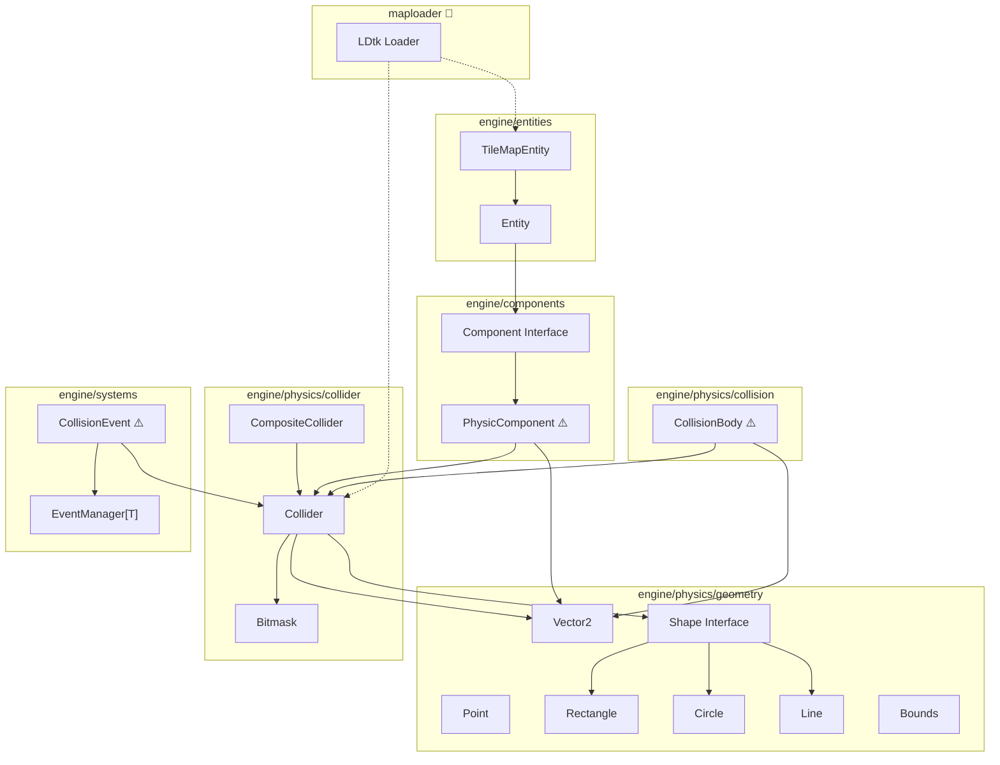
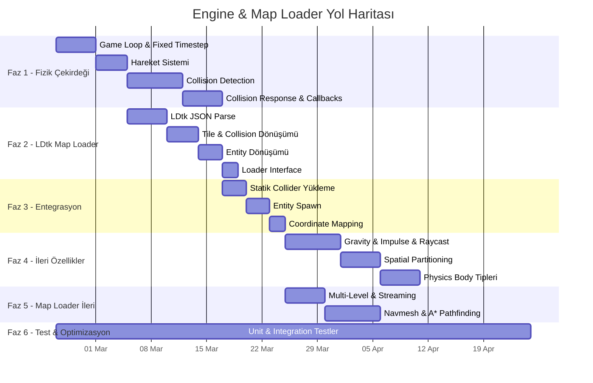

# 🗺️ Headless 2D Fizik Engine & LDtk Map Loader — Yol Haritası

**Proje:** MyHobie2DRpgGame  
**Tarih:** 2026-02-20  
**Hedef:** Server-otoriter, headless bir 2D fizik motoru + LDtk harita entegrasyonu

---

## 📊 Mevcut Durum Analizi

### ✅ Tamamlanan Modüller

| Modül | Dosya(lar) | Durum | Notlar |
|-------|-----------|-------|--------|
| **Geometry — Vector2** | `physics/geometry/vector2.go` | ✅ Tamamlandı | Add, Subtract, Multiply, Divide, Length, Normalize, Rotate, Transform |
| **Geometry — Point** | `physics/geometry/point.go` | ✅ Tamamlandı | DistanceTo hesaplaması mevcut |
| **Geometry — Shape Interface** | `physics/geometry/ishape.go` | ✅ Tamamlandı | GetType, GetCenter, SetCenter, GetBounds, Intersects*, Contains* |
| **Geometry — Rectangle** | `physics/geometry/rectangle.go` | ✅ Tamamlandı | AABB tabanlı, tüm Shape intersection/containment metodları var, testler var |
| **Geometry — Circle** | `physics/geometry/circle.go` | ✅ Tamamlandı | Tüm intersection/containment metodları var, testler var |
| **Geometry — Line** | `physics/geometry/line.go` | ✅ Tamamlandı | Orientation-based intersection, ContainsPoint collinearity check, testler var |
| **Geometry — Bounds** | `physics/geometry/ishape.go` | ✅ Tamamlandı | AABB MinX/MinY/MaxX/MaxY, Width/Height, Intersects |
| **Collider** | `physics/collider/collider.go` | ✅ Tamamlandı | ShapeList, Transform, Rotation, LayerMask/MatchMask, IsTrigger, WorldSpace dönüşümler |
| **CompositeCollider** | `physics/collider/composite_collider.go` | ✅ Tamamlandı | Multi-part body parts (boss, vehicle), AABB bounds hesaplama |
| **Bitmask (Layer System)** | `physics/collider/bitmask.go` | ✅ Tamamlandı | SetBit, ClearBit, IsSet, CanMatch, SetLayers, HasAny, HasAll + testler |
| **Component Interface** | `components/icomponent.go` | ✅ Tamamlandı | Lifecycle: Start, Update, OnCreate, OnDestroy, Serialize/Deserialize |
| **PhysicComponent** | `components/physic_component.go` | ⚠️ İskelet | staticBody/kinematicBody/rigidBody tipleri tanımlı, Update boş |
| **Entity** | `entities/entity.go` | ✅ Tamamlandı | Identifier, IID, Position, Tags, Components, Data |
| **TileMapEntity** | `entities/tilemap_entity.go` | ✅ Tamamlandı | Property, TileRect, Tileset, EnumSet yapıları |
| **Event System** | `systems/event_system/` | ✅ Tamamlandı | Generic EventManager[T], Register/Unregister/Emit, goroutine-safe |
| **CollisionEvent** | `systems/event_system/collision_event.go` | ⚠️ İskelet | CollisionData tanımlı, OnCollide boş |
| **CollisionBody** | `physics/collision/collision.go` | ⚠️ İskelet | Transform + Radius + Collider, davranış yok |
| **CollisionData** | `data/collision_data.go` | ⚠️ İskelet | ID, Name, Width, Height, Collision dizisi |
| **Map Loader** | `maploader/doc.go` | 🔴 Sadece tanım | LDtk parse henüz yapılmadı |

### 🔍 Mimari Diyagram (Mevcut)



---

## 🚀 Yol Haritası — Fazlar

---

### Faz 1: Fizik Motoru Çekirdeği (Physics Core)
> **Öncelik:** 🔴 Kritik | **Tahmini süre:** 2-3 hafta

#### 1.1 — Game Loop & Fixed Timestep
- [ ] `engine/world.go` — Ana dünya yapısı (World struct)
  - Entity listesi (dinamik + statik)
  - Tick sayacı
  - DeltaTime sabitlemesi (fixed timestep örn. 20ms = 50Hz)
- [ ] `engine/game_loop.go` — Oyun döngüsü
  - `Start()` → döngüyü başlat
  - `Stop()` → döngüyü durdur
  - `Tick()` → her frame: input işle → fizik güncelle → collision detect → event dispatch → snapshot üret
  - Accumulator pattern ile fixed timestep (gerçek zaman → simülasyon zamanı)

#### 1.2 — Hareket Sistemi (Movement System)
- [ ] `PhysicComponent.Update(dt)` implementasyonu
  - Kinematic hareket: `position += velocity * dt`
  - Acceleration/deceleration desteği
  - Friction (sürtünme) uygulaması
  - Max speed clamp (hile engelleme)
- [ ] `components/transform_component.go` — Position, Rotation, Scale
  - Entity'nin dünya koordinatlarını tutan component
  - PhysicComponent ile senkronizasyon

#### 1.3 — Collision Detection Sistemi
- [ ] Broad Phase: **Spatial Hashing** veya **Quad-Tree**
  - `physics/spatial/spatial_hash.go` — Grid tabanlı spatial hash
    - `Insert(collider)`, `Remove(collider)`, `Query(bounds) []Collider`
    - Grid boyutu yapılandırılabilir (örn. 64x64 birim)
  - Alternatif: `physics/spatial/quadtree.go`
- [ ] Narrow Phase: Kesişim tespiti (zaten mevcut `Intersects*` metodları ile)
  - Shape-Shape çift çözümlemesi (dispatch tablosu veya double dispatch)
  - `physics/collision/detector.go` — Collision pair resolution
- [ ] **Collision Response (Çarpışma Yanıtı)**
  - `physics/collision/resolver.go`
  - Statik cisimler: push-out (separating axis)
  - Kinematic cisimler: sliding collision
  - Trigger (IsTrigger): fiziksel blokaj yok, sadece event
- [ ] **Collision Callbacks**
  - `OnCollisionEnter(other)` — ilk temas
  - `OnCollisionStay(other)` — süre boyunca
  - `OnCollisionExit(other)` — ayrılma
  - CollisionEvent ile EventManager'a entegrasyon

---

### Faz 2: LDtk Map Loader
> **Öncelik:** 🔴 Kritik | **Tahmini süre:** 1-2 hafta

#### 2.1 — LDtk JSON Dosya Parse
- [ ] `maploader/ldtk_project.go` — Ana LDtk proje yapısı
  - LDtk JSON formatını Go struct'larına deserialize et
  - Desteklenecek alanlar:
    - `levels[]` — Her seviye (Level)
    - `defs.tilesets[]` — Tileset tanımları
    - `defs.entities[]` — Entity tanımları
    - `defs.enums[]` — Enum tanımları
- [ ] `maploader/ldtk_level.go` — Level yapısı
  - World koordinatları (worldX, worldY)
  - Boyut (pxWid, pxHei)
  - Layer instance'ları
- [ ] `maploader/ldtk_layer.go` — Layer yapısı
  - Layer türleri: IntGrid, Tiles, Entities, AutoLayer
  - gridSize, tile verileri
  - IntGrid değerleri (collision layer için)

#### 2.2 — Tile & Collision Layer Dönüşümü
- [ ] `maploader/tile_converter.go`
  - LDtk IntGrid → Engine collision grid dönüşümü
  - Her IntGrid değeri → CollisionType eşlemesi (0=boş, 1=solid, 2=platform, vb.)
  - Sonuç: `CollisionGrid` (2D int dizisi) + metadata
- [ ] `maploader/collider_builder.go`
  - Collision grid → fizik motoru Collider objeleri oluşturma
  - Bitişik solid hücreleri birleştirerek optimize AABB'ler üret (greedy meshing)
  - Statik collider olarak World'e ekleme

#### 2.3 — Entity Dönüşümü
- [ ] `maploader/entity_converter.go`
  - LDtk entity instance'ları → Engine Entity/TileMapEntity
  - Property (fieldInstances) mapping
  - Spawn point, NPC, trigger zone gibi entity türleri
  - Tileset referanslarını bağlama

#### 2.4 — Loader Interface & Entegrasyon
- [ ] `maploader/loader.go` — Ana loader interface'i
  ```go
  type MapLoader interface {
      LoadProject(path string) (*LDtkProject, error)
      LoadLevel(project *LDtkProject, levelID string) (*GameLevel, error)
      GetCollisionGrid(level *GameLevel) *CollisionGrid
      GetEntities(level *GameLevel) []*Entity
  }
  ```
- [ ] `maploader/game_level.go` — Engine tarafında level temsili
  - Collision grid
  - Entity listesi
  - Tileset referansları
  - Level boyutları (pixel / world unit dönüşümü)

---

### Faz 3: Fizik Motoru ile Harita Entegrasyonu
> **Öncelik:** 🟠 Yüksek | **Tahmini süre:** 1-2 hafta

#### 3.1 — Statik Dünya Collider'ları
- [ ] LDtk collision grid → World'e statik collider olarak yükleme
- [ ] Tile-based collision: her solid tile → AABB Rectangle collider
- [ ] Composite collider optimizasyonu: bitişik tile'ları tek collider'a birleştir

#### 3.2 — Entity Spawn
- [ ] LDtk entity'leri → Engine Entity + PhysicComponent olarak oluştur
- [ ] Spawn point entity'lerinden oyuncu/NPC başlangıç konumlarını al
- [ ] Trigger zone entity'leri → IsTrigger collider olarak oluştur

#### 3.3 — Coordinate System
- [ ] LDtk pixel koordinatları → Engine world koordinatları dönüşümü
- [ ] Grid-based koordinat sistemi (tile size bazlı)
- [ ] Origin konvansiyonu belirleme (sol-üst vs merkez)

---

### Faz 4: İleri Fizik Özellikleri
> **Öncelik:** 🟡 Orta | **Tahmini süre:** 2-3 hafta

#### 4.1 — Gelişmiş Hareket
- [ ] Gravity (yerçekimi) desteği — platformer mekanikleri için
- [ ] Impulse (anlık kuvvet) sistemi — knockback, dash
- [ ] Raycast — Line-of-sight, projectile hit tespiti
  - `physics/raycast.go` — Ray → Shape intersection
  - İlk hit noktası + hit normal vektörü döndür

#### 4.2 — Spatial Partitioning Optimizasyonu
- [ ] AOI (Area of Interest) sistemi
  - Her oyuncu için görünür alan yarıçapı
  - Sadece AOI içindeki entity'leri güncelle/gönder
- [ ] Grid-based bucket sistemi (chunk'lar: örn. 128x128 tile)
- [ ] Entity bucket kayıt/güncelleme

#### 4.3 — Physics Body Tipleri
- [ ] `staticBody` — Asla hareket etmez (duvar, zemin)
- [ ] `kinematicBody` — Programatik hareket (hareketli platform, kapı)
- [ ] `rigidBody` — Kuvvetlerin etkisi altında (projectile, ragdoll)
- [ ] Her tip için doğru collision response

---

### Faz 5: Map Loader Gelişmiş Özellikler
> **Öncelik:** 🟡 Orta | **Tahmini süre:** 1-2 hafta

#### 5.1 — Multi-Level Desteği
- [ ] Birden fazla level yükleme ve yönetme
- [ ] Level geçiş noktaları (portal/kapı entity'leri)
- [ ] Level streaming (büyük dünyalar için lazy loading)

#### 5.2 — Auto-Layer & Rule-Based Tile Desteği
- [ ] LDtk auto-layer kurallarını backend'de destekleme
- [ ] Enum-based tile metadata (ör. "ice" → kayma, "lava" → hasar)

#### 5.3 — Navmesh / Pathfinding Desteği
- [ ] LDtk'den navigation grid çıkarma
- [ ] A* pathfinding implementasyonu
  - `physics/pathfinding/astar.go`
  - Grid-based A* (IntGrid üzerinde)
- [ ] NPC AI için yol bulma entegrasyonu

---

### Faz 6: Test & Optimizasyon
> **Öncelik:** 🟢 Sürekli | **Tahmini süre:** Tüm fazlara paralel

#### 6.1 — Unit Testler
- [ ] Geometry testlerini genişlet (edge case'ler)
- [ ] Collision detection testleri (tüm shape kombinasyonları)
- [ ] Spatial hash / quadtree performans testleri
- [ ] Map loader parse testleri (örnek LDtk dosyası ile)
- [ ] Game loop tick doğruluğu testleri

#### 6.2 — Benchmark & Profiling
- [ ] N entity collision detection benchmark'ı (10/100/1000/5000)
- [ ] Spatial hash vs brute-force karşılaştırma
- [ ] Map loading süresi benchmark'ı
- [ ] Memory profiling (büyük haritalar için)

#### 6.3 — Integration Testleri
- [ ] LDtk dosyası yükle → collision grid oluştur → entity spawn → fizik simülasyonu çalıştır
- [ ] Hareket → collision → event callback zinciri testi

---

## 📁 Önerilen Dosya Yapısı

```
backend/services/
├── engine/
│   ├── world.go                    # [YENİ] Ana dünya yapısı
│   ├── game_loop.go                # [YENİ] Fixed timestep game loop
│   ├── components/
│   │   ├── icomponent.go           # [MEVCUT] Component interface
│   │   ├── physic_component.go     # [GÜNCELLE] Hareket implementasyonu
│   │   └── transform_component.go  # [YENİ] Position/Rotation/Scale
│   ├── entities/
│   │   ├── entity.go               # [MEVCUT] Base entity
│   │   └── tilemap_entity.go       # [MEVCUT] Tilemap entity
│   ├── physics/
│   │   ├── geometry/               # [MEVCUT] ✅ Tamamlandı
│   │   ├── collider/               # [MEVCUT] ✅ Tamamlandı
│   │   ├── collision/
│   │   │   ├── collision.go        # [GÜNCELLE] CollisionBody davranış ekle
│   │   │   ├── detector.go         # [YENİ] Narrow phase detection
│   │   │   └── resolver.go         # [YENİ] Collision response
│   │   ├── spatial/
│   │   │   ├── spatial_hash.go     # [YENİ] Broad phase
│   │   │   └── quadtree.go         # [YENİ] Alternatif broad phase
│   │   ├── raycast.go              # [YENİ] Raycast sistemi
│   │   └── pathfinding/
│   │       └── astar.go            # [YENİ] A* pathfinding
│   ├── systems/
│   │   └── event_system/           # [MEVCUT] ✅ Tamamlandı
│   ├── data/
│   │   └── collision_data.go       # [MEVCUT] ⚠️ Genişletilecek
│   └── events/                     # [MEVCUT] ⚠️ Doldurulacak
│
└── maploader/
    ├── doc.go                      # [MEVCUT]
    ├── loader.go                   # [YENİ] MapLoader interface & impl
    ├── ldtk_project.go             # [YENİ] LDtk proje struct'ları
    ├── ldtk_level.go               # [YENİ] Level struct & parse
    ├── ldtk_layer.go               # [YENİ] Layer struct & parse
    ├── tile_converter.go           # [YENİ] IntGrid → collision grid
    ├── collider_builder.go         # [YENİ] Grid → collider objeleri
    ├── entity_converter.go         # [YENİ] LDtk entity → engine entity
    └── game_level.go               # [YENİ] Engine-side level temsili
```

---

## ⏱️ Zamanlama Özeti



---

## 🎯 Öncelik Sıralaması

1. **Faz 1.1** — Game Loop → Motor hiçbir şey çalıştıramaz bu olmadan
2. **Faz 1.2** — Hareket Sistemi → Entity'ler hareket edebilmeli
3. **Faz 2.1-2.2** — LDtk Parse + Collision Grid → Dünya oluşturulabilmeli
4. **Faz 1.3** — Collision Detection → Entity'ler duvarlara çarpabilmeli
5. **Faz 3** — Entegrasyon → Her şey bir arada çalışmalı
6. **Faz 4-5** — İleri özellikler (gravity, raycast, pathfinding)
7. **Faz 6** — Sürekli test ve optimizasyon

---

> **Not:** Bu yol haritası GDD'deki (Game Design Document) tasarım kararlarına uygun olarak hazırlanmıştır. Her faz tamamlandığında bir sonraki faza geçmeden önce integration testleri ile doğrulama yapılmalıdır.
